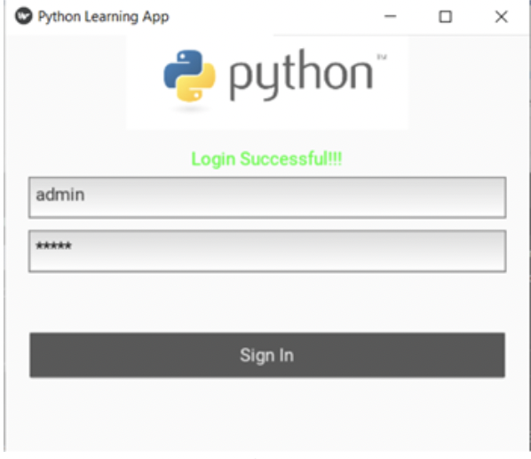

# Intelligent Python Learning App
[]()
>Intelligent Python learning app that provides user the freedom to select the content source (open source book) and generates summarized notes of a book. Further facilitates user to evaluate his learning through MCQs. Performance can be tracked through graph generated after submission of answers.

### How to Use this App:
  1. Run main.py 
  2. Use following credentials for login:
```sh
    Username: admin
    Password: admin
```
  3. Click on a book to select resource, (for sake of simplicity all books links to same text resource)
  4. Click forward and back arrow to navigate in app
  .1. clicking back arrow takes back to login page
   .2. clicking forward arrow will load interactive test screen
    You can also:
    .1. Load questionaire from resource selection screen
    .2. for demo purpose only, limited (4) set of questions are loaded, whereas the full set of questionaire includes more than 100 question

##### Perform test:
1. Select answers and submit to evaluate your score 
2. close the popup evaluation screen to view the answers and explanation

### App Screenshots
App Data Flow is staged into 5 steps:
1. User Validation: Screen design comprises of single box layout with Text field inputs and sign in button widget. Screen is designed to provide the user an interface to store and validate its credentials
2. Text Book selection: Screen design is divided into grid layout, to display available text resources for selection and link to take test. For image selection, Image button class is made by inheriting Image and Button class
3. Book Summarization: Page Layout is used on this screen to get text summary in book style view, to easily swipe pages back and forth.
4. Question Bank/Test: Screen comprises of box layout view split in half to display questions and answer selection for radio box.
5. Performance Evaluation: Screen comprises of two display windows, one for user graph and another for explanation of answers

<table>
  <tr>
<td align="center">
  <figure>
    
    <br>
    <figcaption>Fig. 1. Validation Screen</figcaption>
   </figure>
 </td>
  <td align="center">
    <figure>
    
    <br>
    <figcaption>Fig. 2. Resource Selection</figcaption>
   </figure>
  </td>
  <td align="center">
    <figure>
    
    <br>
    <figcaption>Fig. 3. Summarized Book</figcaption>
   </figure>
  </td>
  </tr>
  <tr>
<td align="center">
    <figure>
    
    <br>
    <figcaption>Fig. 4. Interactive questions</figcaption>
   </figure>
 </td>
  <td align="center">
    <figure>
    
    <br>
    <figcaption>Fig. 5. User Evaluation</figcaption>
   </figure>
  </td>
  <td align="center">
    <figure>
    
    <br>
    <figcaption>Fig. 6. Answers and explanation</figcaption>
   </figure>
  </td>
    </tr>
</table>


### Software and Libraries required
Intelligent Python Learning App uses a number of open source projects to work properly:

* Kivy- for APP GUI
* KivyMD - Material Theme resources
* python 3.7 IDE - for better support of kivy libraries
* sumy - to implement summarization algorithms 
* Beautiful Soup - to implement the webscarpping
* numpy - to process the data
* csv - to read and write csv file
* matplotlib - to plot the graphs
* sklearn - to implement machine learning
* pandas - to process the data
* urllib.request - to fecth urls
